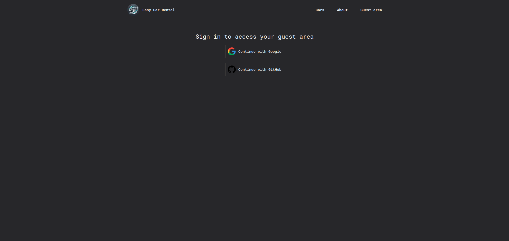

# Easy Car Rental

Easy Car Rental is a web application designed to provide a seamless and luxurious car rental experience. The platform offers a wide range of premium vehicles, allowing users to easily browse, select, and reserve the perfect car for their journey.

## Features

- **User Authentication:** Secure login and registration using NextAuth.js for authentication.
- **Car Browsing:** Users can browse a diverse range of cars, with filtering options based on price and availability.
- **Real-Time Availability:** Integration with Supabase allows for real-time updates on car availability.
- **Responsive Design:** Optimized for all devices, ensuring a smooth experience on desktops, tablets, and mobile devices.
- **User Dashboard:** Users can view and manage their reservations, with detailed information on each booking.

## Technologies Used

- Next.js, Tailwind CSS, Supabase
- **Additional Libraries:** Heroicons, NextAuth.js

## Screenshots

